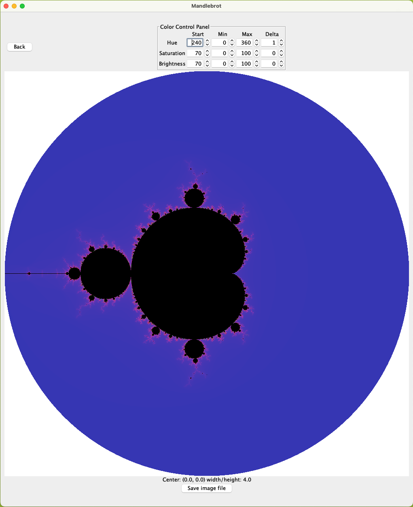
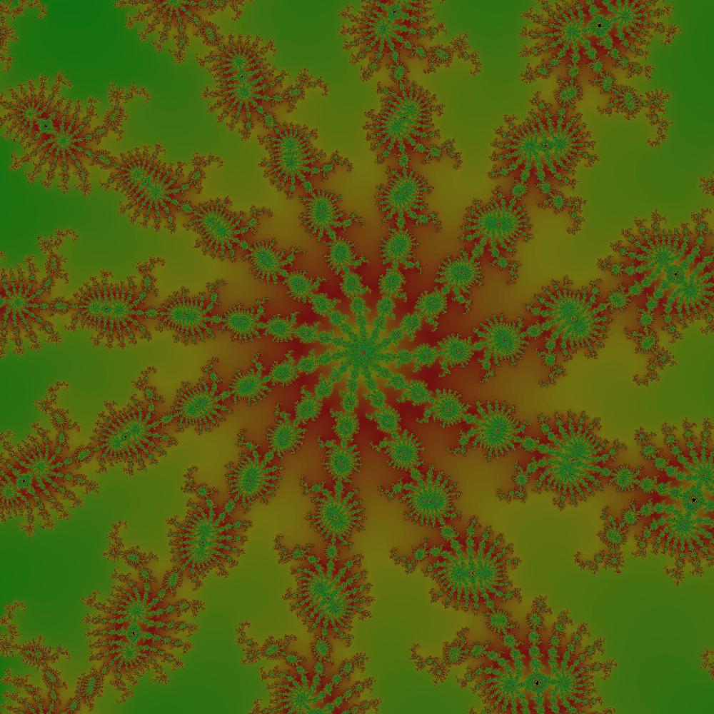

# mandlebrot-fun
Java application for generating Mandlebrot fractals.

This is what it looks like when it starts up.

Here is an image with center (-0.724140625, 0.2864375000000003), width/height 0.00390625.

